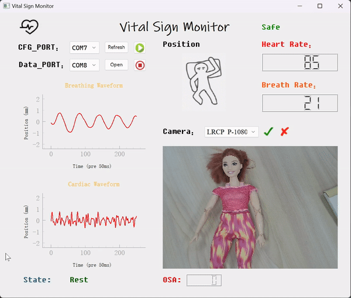
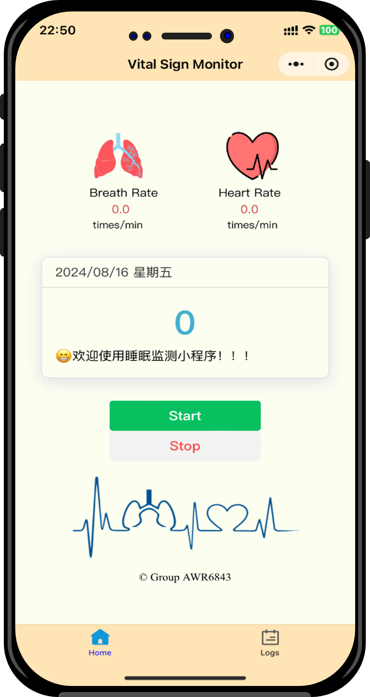

# HoloSleep Monitor: Non-contact Sleep Monitoring System

  

**Multi-modal sleep monitoring system combining mmWave radar and computer vision**

## 📖 Overview

HoloSleep Monitor is an innovative non-contact sleep monitoring system that integrates **mmWave radar vital signs detection** with **computer vision-based pose recognition**. The system utilizes Texas Instruments' AWR6843 radar for real-time breathing and heart rate monitoring, combined with camera and OpenPose for sleep posture classification, providing comprehensive sleep health analysis.

## ✨ Key Features

### 🔬 Multi-modal Sensing
- **mmWave Radar Monitoring**: Non-contact detection of respiration rate (8-20 BPM) and heart rate (60-100 BPM)
- **Visual Pose Recognition**: Real-time human pose estimation using OpenPose
- **Sleep Posture Classification**: SVM-based classifier for 7 common sleep positions

### 📊 Intelligent Analytics
- **Real-time Vital Signs Visualization**: Live waveforms for breathing and heart rate
- **Posture Duration Statistics**: Time analysis for each sleep position
- **Anomaly Detection**: Alert system for apnea and arrhythmia
- **Sleep Quality Assessment**: Comprehensive scoring based on multiple parameters

### 🎨 Unified Interface
- **Multi-view Display**: Simultaneous radar data, camera feed, and skeletal overlay
- **Real-time Dashboard**: Key metrics at a glance
- **Historical Review**: Playback and analysis of sleep sessions

## 🖥️ Interface Demonstration

| Desktop Application | WeChat Mini Program |
|---------------------|---------------------|
| 

 | 

 |
| Comprehensive monitoring interface | Mobile mini-program for convenient viewing |

## 🛠️ Technical Stack

### Hardware Requirements
- **Radar**: Texas Instruments AWR6843ISK-ODS
- **Camera**: USB webcam (1080p recommended) or IP camera
- **Processing Unit**: x86/ARM platform (tested on Jetson Nano, Raspberry Pi 4, PC)

### Software Dependencies
- **Radar Firmware**: TI Vital Signs Demo (vital_signs.bin)
- **Core Framework**: Python 3.8+
- **Computer Vision**: OpenCV 4.5+, OpenPose
- **Machine Learning**: Scikit-learn, NumPy, SciPy
- **Data Visualization**: Matplotlib, PyQt5
- **Communication**: PySerial

## 📈 Recognized Sleep Positions

The system classifies 7 common sleep positions:

| Position | Icon | Description | Health Impact |
|----------|------|-------------|---------------|
| Supine | 🛌 | Flat on back | May cause snoring |
| Supine Bent Legs | 🤰 | Back with bent knees | Reduces lower back stress |
| Left Lateral | 👈 | On left side | Recommended for digestion |
| Right Lateral | 👉 | On right side | Common position |
| Prone | 🐢 | On stomach | May cause neck strain |
| Fetal | 🧘 | Curled position | Common but may restrict breathing |
| Turning | 🔄 | Transition between positions | Normal during sleep |

## 🧠 Algorithm Details

### Radar Signal Processing
1. **Phase Extraction**: Extract chest wall movement from radar signals
2. **Signal Separation**: Separate breathing and heartbeat using bandpass filters
3. **Frequency Analysis**: Apply FFT to obtain respiration and heart rates

### Visual Pose Recognition Pipeline
1. **Keypoint Detection**: OpenPose extracts 18 body keypoints
2. **Feature Engineering**: Calculate angles and distances between keypoints
3. **Classification**: SVM classifies features into 7 sleep positions
4. **Temporal Smoothing**: Apply moving average for stability

## 🔬 Research Applications

This system enables various research applications:
- **Sleep disorder studies**: Apnea, insomnia, restless leg syndrome
- **Post-surgery monitoring**: Non-contact patient observation
- **Infant monitoring**: Safe, non-invasive baby monitoring
- **Elderly care**: Fall detection and sleep pattern analysis

## 🙏 Acknowledgments

- This project was developed with reference to mmVital-Signs[ https://github.com/KylinC/mmVital-Signs ]
- Texas Instruments for AWR6843 radar hardware and SDK
- CMU Perceptual Computing Lab for OpenPose
- All open-source libraries that made this project possible

---

Built with ❤️ for better sleep health monitoring

